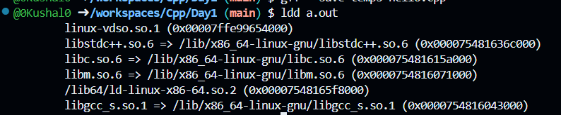
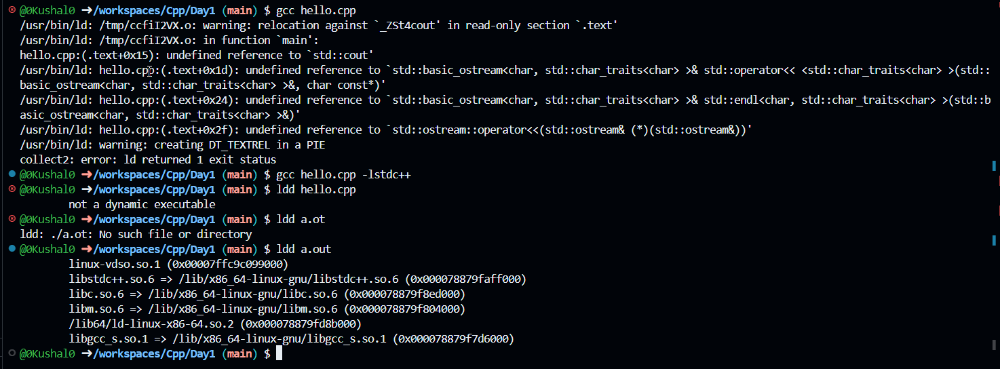

Day1:

1. g++ --save-temps <filename.c/cpp>

    It will generate the all the intermediate files while doing compilation.

    .i -> prepossesing 
    .s -> assembly file depends on the arch
    .o -> object file.
    .exe/.out -> final executable…

2. ldd a.out

    this shows the what are all the linked files/libraries path.

    

3. gcc hello.c -lstdc++

    when I'm using C compiler[gcc] I tried to compile c++ code since the std::cout c++ lib reference is not automatically linked by gcc compiler, we explicitely gave -lstdc++.
    i dont want to do all these, i can use g++ compiler.

    

4. To know g++ symbolic name and which version of c++ i'm using and on which cpu architecture the exec runs.

        @0Kushal0 ➜ /workspaces/Cpp/Day1 (main) $ ls -la /usr/bin/g++
        lrwxrwxrwx 1 root root 6 Jan 31  2024 /usr/bin/g++ -> g++-13

        @0Kushal0 ➜ /workspaces/Cpp/Day1 (main) $ cd /usr/bin
        @0Kushal0 ➜ /usr/bin $ ls -la g++
        lrwxrwxrwx 1 root root 6 Jan 31  2024 g++ -> g++-13
        
        @0Kushal0 ➜ /usr/bin $ ls -la g++-13
        lrwxrwxrwx 1 root root 23 Dec 18 20:59 g++-13 -> x86_64-linux-gnu-g++-13 

5. nm -C a.out

    To know the symbol table and to understand in which memory segments our code sits.

6. ls -la a.out
    
    show everything (including hidden) in detailed format with permissions, owner, size, and timestamp.

    -l Long format — show detailed info per file
    -a All files — include hidden files (starting with .)

6. Questions

    Global variable initialized with zero, is not going into data segment, why?

Day2:

1. Clang
    @0Kushal0 ➜ /usr/bin $ clang --version
    Ubuntu clang version 18.1.3 (1ubuntu1)
    Target: x86_64-pc-linux-gnu
    Thread model: posix
    InstalledDir: /usr/bin

    what is this thread model: posix?
    why do required ABI, without this whats the problem?

Day3:

1. Getting the running process: 
    > ps -ef | grep a.out

    codespa+    3587    1534 93 17:29 pts/1    00:00:22 ./a.out
    codespa+    4257    3664  0 17:30 pts/0    00:00:00 grep --color=auto a.out

    > cd /proc/3587

    @0Kushal0 ➜ /proc/3587 $ cat maps
    63356cc98000-63356cc99000 r--p 00000000 07:04 1310803                    /workspaces/Cpp/Day1/a.out
    63356cc99000-63356cc9a000 r-xp 00001000 07:04 1310803                    /workspaces/Cpp/Day1/a.out
    63356cc9a000-63356cc9b000 r--p 00002000 07:04 1310803                    /workspaces/Cpp/Day1/a.out
    63356cc9b000-63356cc9c000 r--p 00002000 07:04 1310803                    /workspaces/Cpp/Day1/a.out
    63356cc9c000-63356cc9d000 rw-p 00003000 07:04 1310803                    /workspaces/Cpp/Day1/a.out
    63357fa52000-63357fa73000 rw-p 00000000 00:00 0                          [heap]
    7ffd53452000-7ffd53474000 rw-p 00000000 00:00 0                          [stack]

Day4:

1. To guard multiple inclusion of header file in C++ use "#pragma once" at the top of the header file.

Day5:

1. Reference variable in C++:

    - No memory allocated.
    - which is the alias.
    - it can only created with lvalue.
    
2. Questions:

    1. why we are using reference variable feature in C++ and what is the scope? - to be discussed in upcomming recordings.

3. Optimization options:

    g++ -O

4. Debug option:
 
    g++ -g

5. Objdump utility:

    objdump -S --demangl a.out

    -S : include source code with assembly

Day6:

1. To avoid extracting source code from binary, we can use 'strip a.out'. this will remove the symbol table in a.out.

2. lvalue and rvalue:

    lvalue - it has some memory allocated.
    rvalue - it is only a temporary integer literals.

Day7:

1. In c++, there is a dedicated datatye for bool

2. Overloading is available in cpp not in c. even if u give same name of the fn in the source file, but at the final binary 
    if u do nm a.out, u can see the mangled / different name given by compiler, that how fn overloading is working.

3. We cannot create function overloading with only return type. 

4. With extern "C" before function name, will not create a mangles name.

Day8:

1. Default arguments:

    int add (int a, int b, int c= 10);

    values are allways assigned from right to left only.

2. Inline :

    All the inline fns are considered as weak symbol [w] in the a.out.
    It is only a request to the compiler.
    Best for small fns.

3. Scope resolution operator:

    see Day8 - scope.cpp

Day9:

1. To make portable with 8/32/64 bit uC, using <stdint.h>.

2. For Structure, CPU just reads 4bytes at a time.

3. Only diff with Cpp struct is, we can define fn inside the struct.

4. We no need to give full name struct point, instead u can use simply point as a data type name.

5. If function is defined in the struct, same fn will be used for mulitple object creation, bcz of "this" and "::", see Day9 struct.cpp